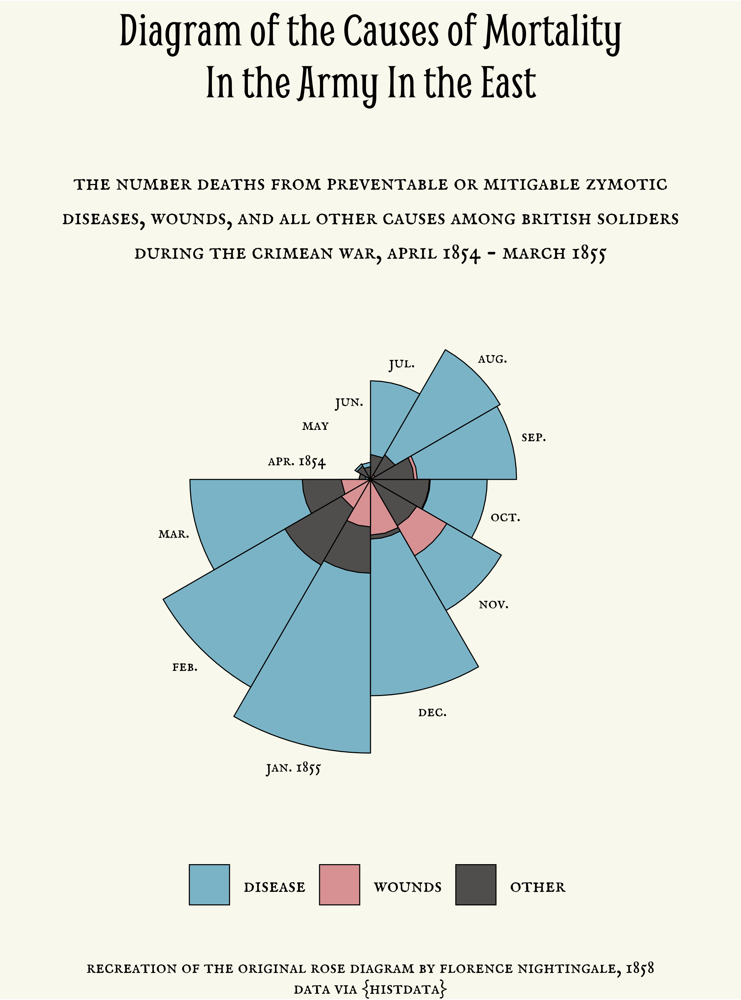

# 30 Day Chart Challenge

## I. Comparisons

### Day 1: Part-to-whole

### Day 2: Pictogram

### Day 3: Historical

### Day 5: Slope

### Day 6: Experimental

## II. Distributions

### Day 7: Physical

### Day 12: Strips

## IV. Time series

### Day 23: Tiles

