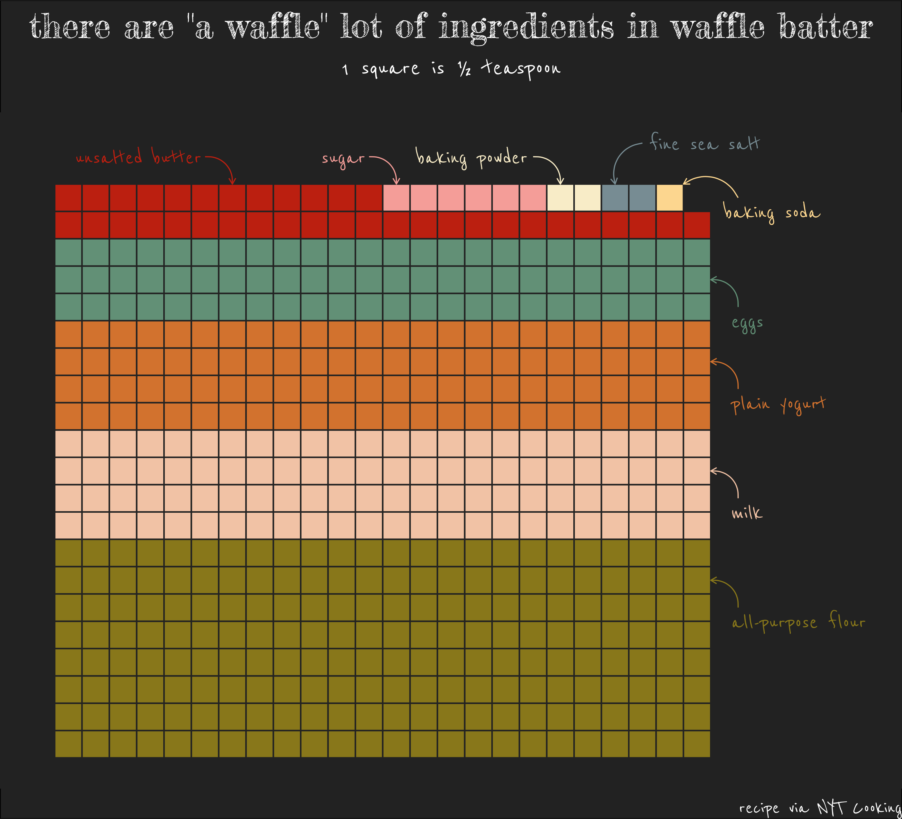

# 30 Day Chart Challenge

## I. Comparisons

### Day 1: Part-to-whole

### Day 2: Pictogram

### Day 3: Historical

### Day 4: Magical

### Day 5: Slope

### Day 6: Experimental

## II. Distributions

### Day 7: Physical

### Day 8: Animals

### Day 9: Statistics

### Day 10: Abstract

### Day 11: Circular

### Day 12: Strips

